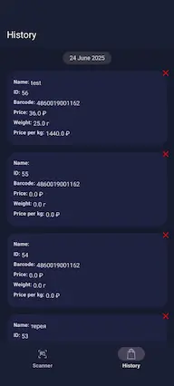

The application allows users to scan product barcodes and save the data to a local database.

Tech stack:
- Android SDK
- [Android Jetpack](https://developer.android.com/jetpack)
- [Kotlin 2.0](https://kotlinlang.org/docs/whatsnew20.html)
- [KotlinX Coroutines](https://github.com/Kotlin/kotlinx.coroutines)
- [KotlinX Serialization](https://github.com/Kotlin/kotlinx.serialization)
- [Retrofit](https://square.github.io/retrofit/) + [OkHttp](https://square.github.io/okhttp/)
- [Jetpack Compose](https://developer.android.com/develop/ui/compose)
- [Rebugger — Jetpack Compose Debugging Tool](https://github.com/LouisCAD/rebugger)
- [Dagger](https://dagger.dev) + [Hilt](https://dagger.dev/hilt/)
- [Jetpack Room](https://developer.android.com/jetpack/androidx/releases/room)
- [Material](https://github.com/material-components/material-components-android)
- [ML Kit Barcode Scanning](https://developers.google.com/ml-kit/vision/barcode-scanning)
- [ML Kit + CameraX Integration](https://developers.google.com/ml-kit/vision/camera-integration)

<pre><code>modules/
├── base/
│   ├── infrastructure
│   ├── resources
│   ├── ui_kit
│   └── ui_model
├── baselineprofile/
├── core/
│   ├── core_api
│   ├── core_factory
│   ├── core_impl
│   └── database
├── dev_tools/ 
├── features/
│   ├── cart/
│   │   ├── cart_api
│   │   └── cart_impl
│   ├── history_of_carts/
│   │   ├── history_of_carts_api
│   │   └── history_of_carts_impl
│   ├── history_of_scans/
│   │   ├── history_of_scans_api
│   │   └── history_of_scans_impl
│   ├── product_details/
│   │   ├── product_details_api
│   │   └── product_details_impl
│   ├── product_edit/
│   │   ├── product_edit_api
│   │   └── product_edit_impl
│   ├── product_insert/
│   │   ├── product_insert_api
│   │   └── product_insert_impl
│   └── scanner/
│       ├── scanner_api
│       └── scanner_impl
│
</code></pre>

Planned features:
1. Settings screen (theme selection, language switching)
2. Code refactor
3. LeakCanary

## Screenshots

  
  
  
  

